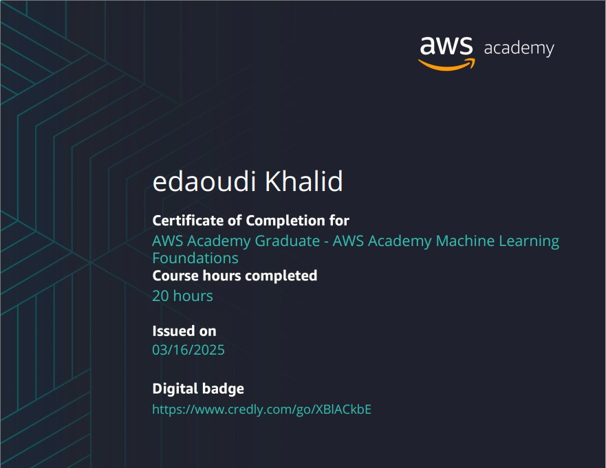
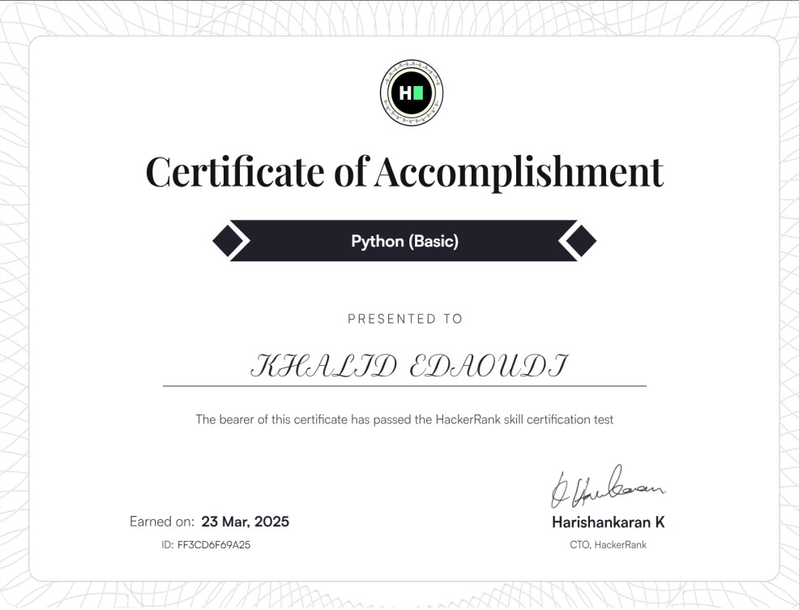
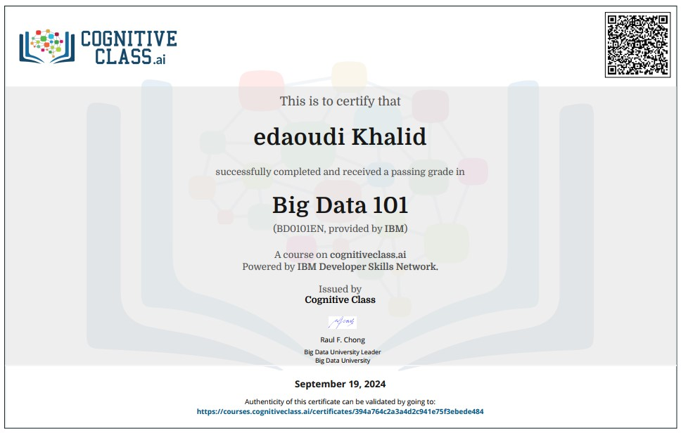
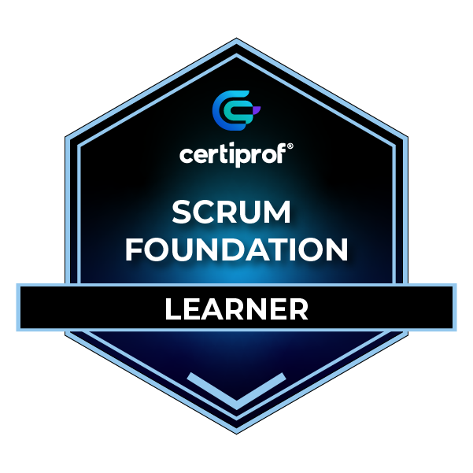
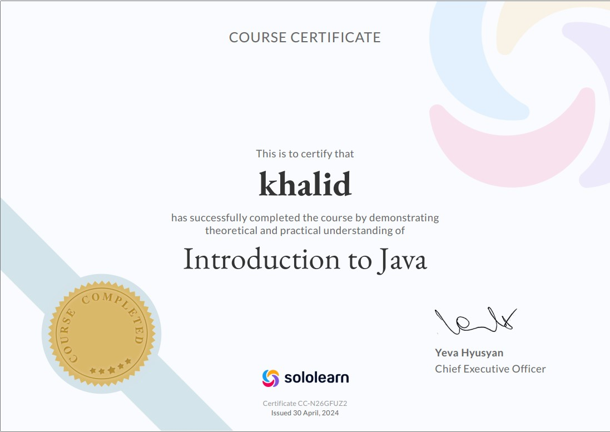
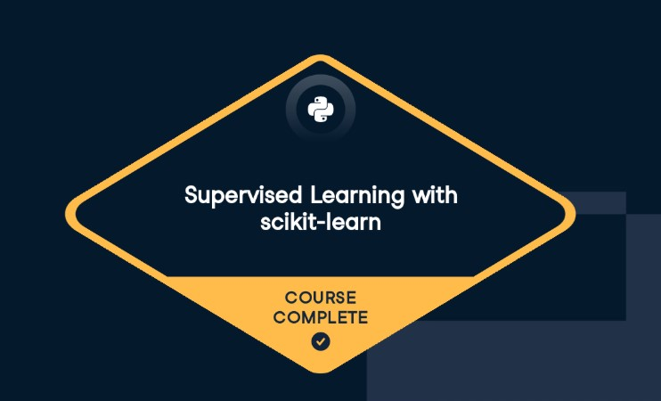

    

 

## 🙋‍♂️ About Me:

 You can reach me by **khalidedaoudi8@gmail.com**

- 🔭 I’m **Khalid Edaoudi**

- 👨‍🎓 **Big Data & IoT** student

- 👨‍💻 I'm so interested by **Software Engineering**, **Data Science** and **Machine Learning**

- 📙 Now I'm currently learning **CI/CD Pipelines**

 

    

 

## ♨️ Programming languages:

    

## 🌐 Web technologies:

    

## 💡 Data Science and Machine Learning

        
    
    
    

## 🛢️ Database Management

    
    
    

## ♾️​ DevOps

                  

## 🛠️ Tools

     

 

    

 
 

## 🎖️ My Certifications

 
 

## 📈​ My Statistics

  <a href="https://github.com/khalid21456">
    
    &emsp;
    
  </a>

 
 

## ​✅ Contributions

  

 <i>“ Talk is cheap, show me code ”</i>
    ― Linus Torvalds

