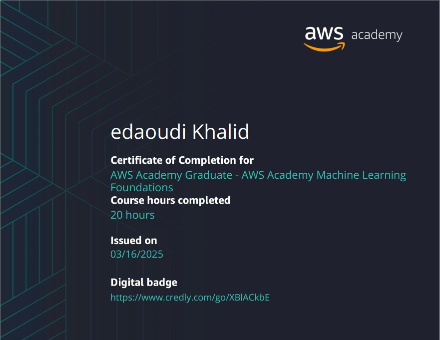
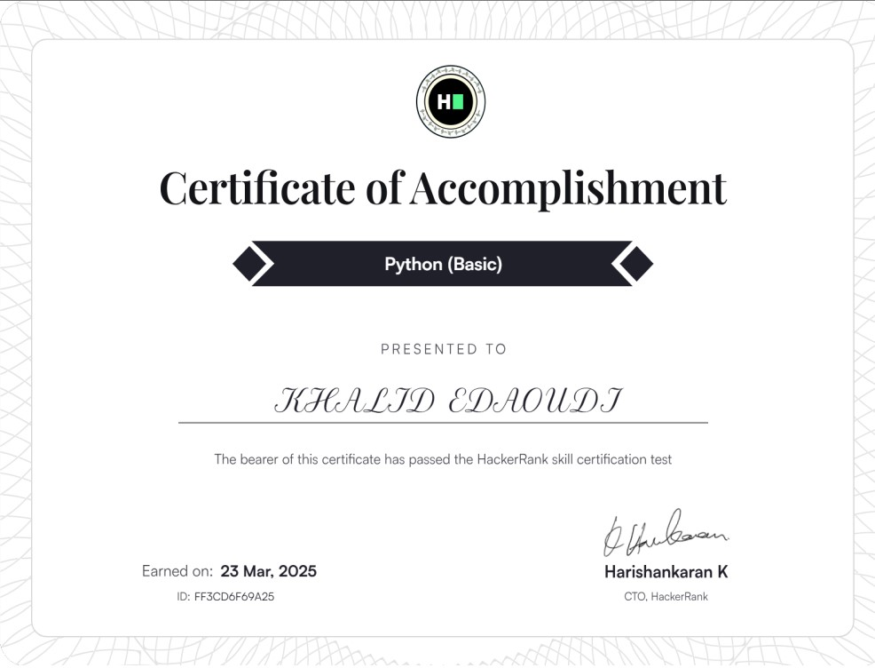
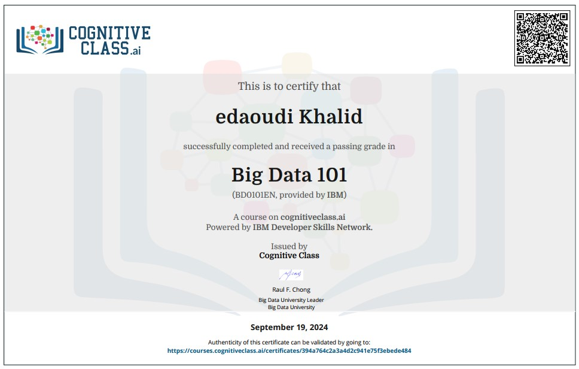
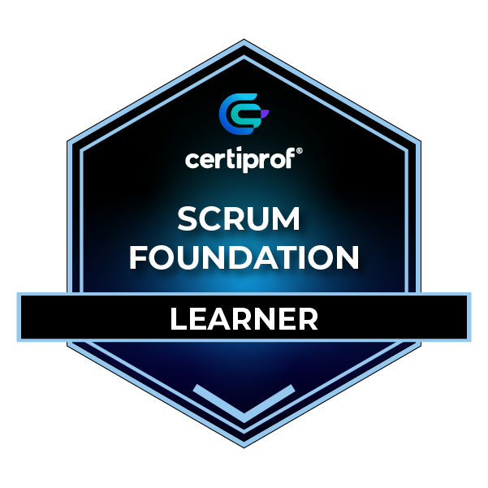
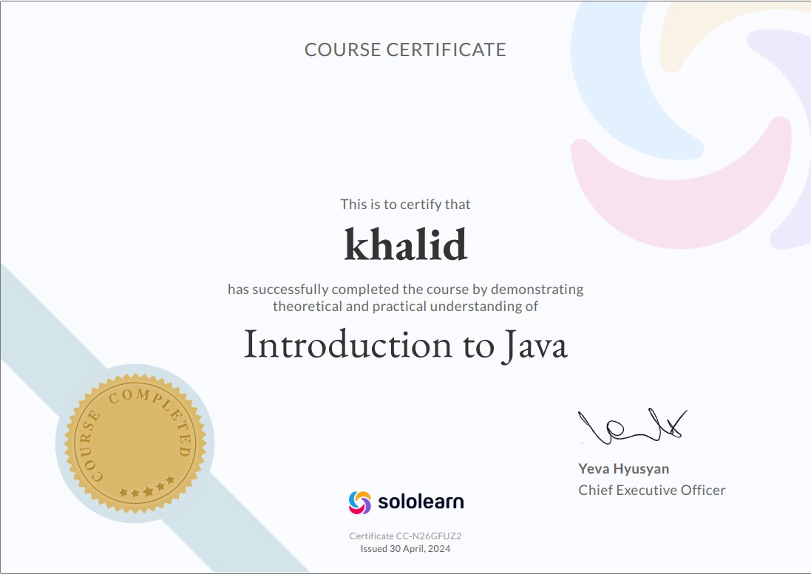
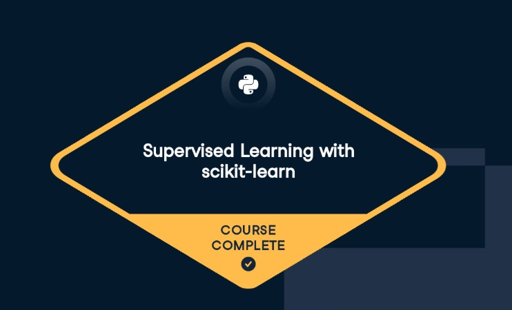
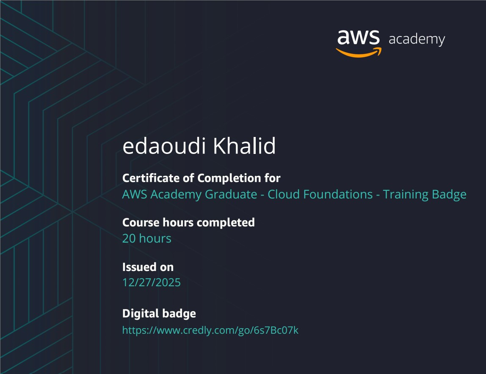

    

 

## 🙋‍♂️ About Me:

 You can reach me by **khalidedaoudi8@gmail.com**

- 🔭 I’m **Khalid Edaoudi**

- 👨‍🎓 **Big Data & IoT** student

- 👨‍💻 I'm so interested by **Software Engineering**, **Data Science** and **Machine Learning**

<!--- 📙 Now I'm currently learning **CI/CD Pipelines**-->

 

    

 

## ♨️ Programming languages:

    

## 🌐 Web technologies:

    

## 💡 Data Science and AI

        
    
    
    

## 🛢️ Database Management

    
    
    

## ♾️​ DevOps & Big Data

                  

## 🛠️ Tools

     

 

    

 
 

## 🎖️ My Certifications

 
 

## 📈​ My Statistics

    

 
 

 <i>“ Don't think outside the box, find the box ! When faced with an impossible problem, identify the real constraints. Ask yourself: Does it have to be done this way? Does it have to be done at all ? ”</i>

